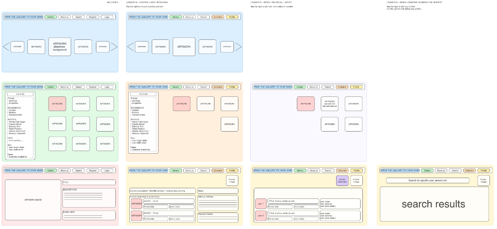
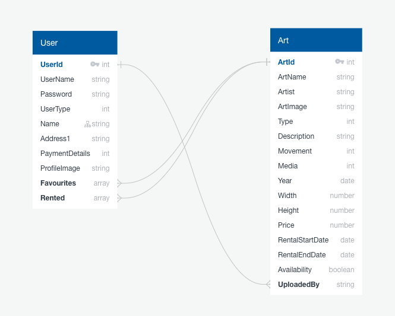
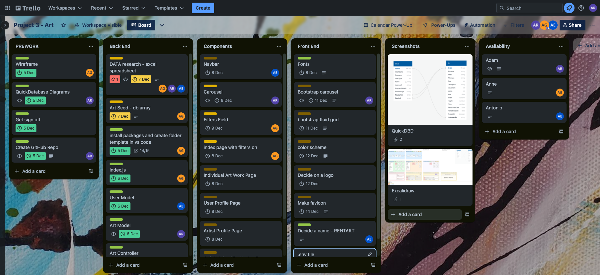
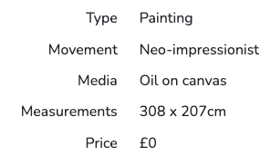

# Rentart

## Description

A full stack multi-page site to allow art enthusiasts and artists to share and rent out art pieces. This was completed over one week in our ninth week of the Software Engineering course as a group of three.

## Deployment link

[Rentart Live Link](https://rentart-cd0c0a3107de.herokuapp.com/)

## Getting Started/Code Installation

#### Packages to download
React, React-router-dom, Bootstrap, React Bootstrap, Sass, Node, Axios, MUI, Vite, Bcrypt, Dotenv, Express, JWT (JSON Web Token), Mongoose.

## Timeframe & Working Team (Group)

Group project - 3 people - One week project.  
Start planning in the afternoon of Tuesday 4th Dec for presentations Friday 15th Dec.  
Wednesday 5th Dec 2023 - Friday 15th Dec 2023.
#### Other group members:
* [Anne-Laure Guiot](https://github.com/Annel18)
* [Antonio Climent](https://github.com/Nemomain)

## Technologies Used

HTML, CSS, JavaScript, MERN Stack (MongoDB, Express, React, Node.js), Axios, Mongoose, Vite, JSON, Bcrypt, JWT, npm, Dotenv, Bootstrap, Sass, MUI, Git, GitHub, Heroku, Cloudinary, Bearer Tokens, Chrome DevTools.

Insomnia, Excalidraw, Quick DBD, Trello, VS Code.


## Brief

#### Overview
Build a full-stack application by making your own backend and your own front-end.

#### Technical Requirements

Use an Express API to serve your data from a Mongo database.
Consume your API with a separate front-end built with React.
Be a complete product which most likely means multiple relationships and CRUD functionality for at least a couple of models.
Implement thoughtful user stories/wireframes that are significant enough to help you know which features are core MVP and which you can cut.
Have a visually impressive design to kick your portfolio up a notch and have something to wow future clients & employers.
Be deployed online so it's publicly accessible.


## Planning

#### Ideas
As a group we discussed two options, one on the motor industry and one around being able to rent pieces of artwork. We began with a headstart as Anne-Laure had already fleshed out her proposal with a wireframe to explain her idea which was very detailed and seemed like a great direction. It gave us the opportunity to add in all the requirements we needed, whilst also giving us the ability to add in some stretch goals to flesh out the idea.
The site will allow users to create an account, log in and out, add art pieces to their favourites, select to rent art pieces, and for artists they can upload their own artwork.

#### Wireframing
As mentioned above, this was mostly in place so we took the time to ensure a good user flow, add in extra functionality, for example a main admin search page, and an artist only page to upload their own artwork. I also used Quick DBD for us to get an idea of how our Models and Schemas would interact and function. 





#### Working Process
As part of planning, Anne-Laure set up a Trello board for us to set out tasks to be completed, talk through delegation of tasks as a group, and for us to establish timelines for each task. I was to begin with the individual art pages and the Bootstrap carousel for the main page. Throughout the task we regularly consulted the board in morning stand ups and through the day. This meant we could ensure we were on track, discuss support if necessary and most importantly, so as not to double up on work.
We worked whilst on Zoom for good communication in the day, and to screen share for bug fixing. We also used branches for different components or similarly grouped components. 




## Build/Code Process

#### Wednesday Day 1
I made the art model to set out the details we would want for each art piece, and the art controller for each method we would need in the project, `GET` for all the art pieces in the database, and a single piece of art, `POST` for the artists to upload their pieces, and `PUT` and `DELETE` for editing and removing artwork if you are the artist or admin. I then tested these paths using Insomnia. We all began adding some seed data to an Excel sheet so we had some basic information to use and could begin adding this in. 
I then got started on the Bootstrap carousel which would be a component and would make up the main feature on the landing page for the user. 

#### Thursday Day 2
I finalised the work and styling on the carousel, it was initially accessing all the data from the database, so Antonio created a function which would return just a small sample of artwork at random from the database using the Mongoose Aggregate and $sample. I then made edits to this as it needed a set numerical size to know how many to return. This meant on each load of the page a new call would be made, which in turn meant the user got a different selection in their carousel. This was then styled within Bootstrap and with some CSS.
```javascript
export const getSomeArt = async (req, res) => {
  try {
    const { artCount } = req.params
    const randomArt = await Art.aggregate([
      { $sample: { size: 6 } }
    ])
    return res.json(randomArt)
  } catch (error) {
    console.log(error)
    return res.status(400).json(error)
  }
}
```

I then created the ‘Individual Art Page’ which you would be taken to on clicking a piece of art to get a more detailed description and larger image. I then styled this using Bootstrap rows and columns.
For a bit of a rest and because we needed more data to use, I then added in all the art information from the Excel sheet to the art seed data. 

#### Friday Day 3
I created paths from the carousel and main gallery (‘Art Index’) to take the user to the ‘Individual Art Page’ by clicking on an art piece.
I then started an image uploader, which would be for the user to upload a profile picture but also for artists to upload their own artwork. 

#### Saturday afternoon, Monday, Tuesday
Continued work on the image uploader. This proved to be difficult as this had originally been added to a portfolio page which went through several iterations from other group members, so I moved this completely to its own component. Outlet Contex and Local Storage raised issues with being able to save the image to the User's data, so it would fail on logging in and out. Changes were made to the Nav and Login to use State.
```javascript
import axios from 'axios'

export default function ImageUploadField({ userData, setUserData, placeholderImg }) {
  async function updateUserImage(secure_url) {
    try {
      const res = await axios.put('/api/profile', { profileImage: secure_url }, {
        headers: {
          Authorization: `Bearer ${userData.token}`,
        },
      })
      setUserData((prevUserData) => ({...prevUserData, profileImage: res.data.profileImage}))
      } catch (error) {
        console.log(error)
      }
    }
  async function handleImageUpload(e) {
    const preset = import.meta.env.VITE_UPLOAD_PRESET
    const file = e.target.files[0]
    const endPoint = import.meta.env.VITE_UPLOAD_URL

    const data = new FormData()
    data.append('file', file)
    data.append('upload_preset', preset)


    const { data: { secure_url }} = await axios.post(endPoint, data)
    
    updateUserImage(secure_url)
  }

  return (
    <>
      
      <input type='file' className='imgUploadButton' name='profileImage' onChange={handleImageUpload} />
    </>
  )
}
```

#### Tuesday Day 5
Styling of uploader and added this into the various Profile pages for different types of user.
Began working on a form for the Artist Profile’s to access, which means they can upload their own art pieces with an image.

#### Wednesday Day 6
The Artist upload component is completed, this pushes the art information and image to the art index and adds the data to the personal collection of the Artist’s user data. I also wrote a function to disable the submit button until all fields are complete and ready to upload. 
```javascript
const keysArray = Object.keys(inputs)
  const count = keysArray
  const artUploadField = document.querySelector('.artUploadField')
  const submitBtn = document.querySelector('.submitBtn')
  if ((count.length === 11) && !artUploadField.value !== true) {
    submitBtn.disabled = false
  }
```

As a group, we looked through the site together for styling issues, and I filled in the Trello board and we discussed assigning tasks based on bandwidth and skill set. Added responsive styling to the carousel element I had created.

#### Thursday Day 7
Finalising styling tasks from Trello by making the Profile pages and navigation bar mobile friendly. Final pushes to GitHub and deployed to Heroku.


## Challenges

The biggest challenge was the image uploader as mentioned above. I should have created this fully in its own component from the start so as not to have changes to the page by other team member’s influence how it was progressing. I also should have gained a better understanding earlier of why we were using `Outlet` and  `useOutletContext` and how it would influence what I was working on. As it directly influenced how I could use and save data in a positive and a negative way.

This was the first project I had worked on in a large group and used Git branching, in all honestly I found, and still kind of do find this very fiddly for something developers use to streamline their work. The benefits of working in silo from a larger project so as not to disrupt others are obvious, but there’s a lot of back and forth, in and out of branch and development, and pushing and pulling in between.  
`gaa`  
`git commit -m "<commit notes>"`  
`git push`  
`gco development`  
`git pull`  
`gco <feature name>`   
`git merge development`  
`gco development`  
`git merge <feature name>`  
`git push`  


## Wins

The ability for Artists to upload their own artwork was also another achievement as I got a little burned coding the image uploader before. As mentioned above I was able to have the information input by the Artist uploaded to the main gallery of artwork, and also push to the array of the user’s personal collection for them to view everything they had uploaded on their own profile page.
```javascript
const handleChange = (event) => {
    const name = event.target.name
    const value = event.target.value
    setInputs(values => ({ ...values, [name]: value }))
  }
const handleSubmit = (event) => {
    event.preventDefault()
    const formData = new FormData(event.target)
    let json = Object.fromEntries(formData.entries());
    json = { ...json, artImage: uploadArtImg }
    submitArtInfo(json)
  }
  // POST and then navigate to new art page
  async function submitArtInfo(json) {
    try {
      const res = await axios.post('/api/art', json, {
        headers: {
          Authorization: `Bearer ${userData.token}`,
        },
      })
      const artID = res.data._id
      const artistCollection = [...personal_collection, artID]
      updateArtistCollection(artistCollection)
      navigate(`/art/${artID}`)
    } catch (error) {
      console.log(error)
    }
  }

  // push to artist collection
  async function updateArtistCollection(artistCollection) {
    try {
      const res = await axios.put('/api/profile', { personal_collection: artistCollection }, {
        headers: {
          Authorization: `Bearer ${userData.token}`,
        },
      })
      const newData = { ...res.data, token: userData.token }
      setUserData(newData)
    } catch (error) {
      console.log(error)
    }
  }

  // Cloudinary Upload
  async function handleImageUpload(e) {
    const preset = import.meta.env.VITE_UPLOAD_PRESET
    const file = e.target.files[0]
    const endPoint = import.meta.env.VITE_UPLOAD_URL
    const data = new FormData()
    data.append('file', file)
    data.append('upload_preset', preset)
    const { data: { secure_url } } = await axios.post(endPoint, data)
    setUploadArtImg(secure_url)
  }


  // Adds image ready for form upload
  useEffect(() => {
    inputs.artImage = uploadArtImg
  }, [uploadArtImg])
```


A small win, but as I enjoy styling, something I finally found a use for was the nth child and last of type. I had several Bootstrap rows and didn’t want to have lots of classes and separate others out with ID’s so this was the perfect opportunity to align the painting details on the right and left.
```
.indArtTextColumn .row:nth-child(n+3) {
  .col:first-of-type {
    text-align: right;
  }
  .col:last-of-type {
    text-align: left;
  }
}
```



## Key Learnings/Takeaways

Continue to console.log everything! The one time you may forget is the one time it would have saved you 5 minutes (or longer…) of hitting your head against a wall.

Pay attention to what your teammates are working on when they talk through it, even if you don’t understand it straight away or how it may link to what you’re doing at least you have a reference point later if you run into issues, or conflicts in your code. 


## Bugs

Not necessarily a bug, but a styling annoyance would be that the dropdown menus all have their right hand arrows very close to the outer edge. I did spend some time looking into this but as it wasn’t the most pressing I had to set it aside. There’s not an easy styling option, so the workaround seems to be that you remove the visibility of the dropdown arrow altogether and build over it using `::before` and `::after`.


## Future Improvements

We had stretch goals that didn’t affect the site but would be nice to have in future and one feature that will be helpful for an Artist to implement. 

The one feature that would be needed is to give an Artist user profile the ability to edit and delete the artwork that they have uploaded.

Nice to haves are:
* Pagination.
* A friend/artist following functionality.
* Modals for the registration and login forms instead of whole pages. 
* High quality images for each artwork.
